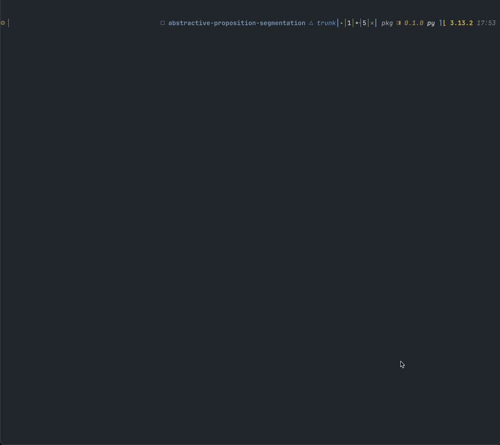

## Gemma APS test

Brief example of [abstractive proposition segmentation](https://arxiv.org/abs/2406.19803) using Google's [Gemma-APS](https://ai.google.dev/gemma/docs/gemma-aps) via
[huggingface transformers](https://huggingface.co/docs/transformers/en/index)



### setup:

- git clone this repo (if you don't know how to do that yet then don't worry about AI, your job will be gone soon anyways)


- create a virtual environment with your tool of choice and then `pip install .` OR use `uv` if you're cool and just `uv sync`


- go to [https://huggingface.co/google/gemma-7b-aps-it](https://huggingface.co/google/gemma-7b-aps-it) and ensure you've agreed to the terms for using the model,
    as gemma-aps is gated (hugging face won't let you download it without an api token that has write access.. i don't know the semantics of that)


- create a .env file with a `HUGGINGFACE_HUB_TOKEN=...`


- run `main.py` (`python main.py` or `uv run main.py`). it takes input from stdin so you can pipe input in or enter it when you've run the program.
    a test file `goose.txt` with some information about geese is provided that can be used:
    ```bash
    cat goose.txt | python main.py
    ```
    OR
    ```bash
    cat goose.txt | uv run main.py
    ```

### note:

you may have to modify lines 30-36 to change the device from `"mps"` (metal performance shaders, used on apple silicon) to the appropriate device for your
hardware (cpu if you're lame, cuda if you are lame but have nvidia gpus)

```python
generator = pipeline(
    "text-generation",
    "google/gemma-7b-aps-it",
    device="mps",
    torch_dtype=torch.bfloat16,
    token=os.environ["HUGGINGFACE_HUB_TOKEN"],
)
```

